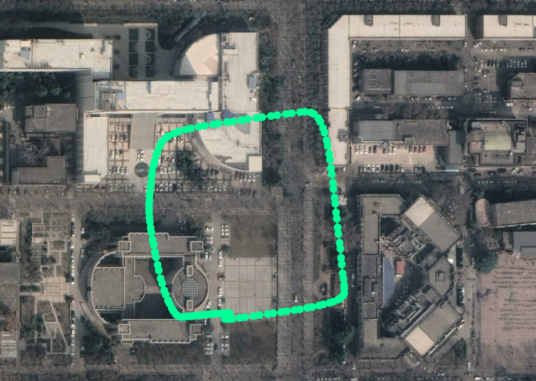

### 介绍

一个把经纬度信息转换为tif图片坐标信息并可视化的小工具

### 1.依赖

 ```
 cv2
 rasterio
 pyproj
 ```

### 2.使用说明

首先你需要把你的数据转换成这个格式：

```
34.2445358,108.9119574
34.244536,108.911957
34.2445361,108.9119566
34.2445364,108.9119563
34.2445366,108.9119561
34.2445371,108.9119558
34.2445381,108.9119554
34.2445395,108.9119555
34.24454,108.9119557
34.2445395,108.9119561
34.2445389,108.9119563
34.2445376,108.9119566
34.2445368,108.9119567
34.244536,108.9119569
```

保存到txt文件中，作为main函数当中的input_data。默认为after_process.txt


然后修改main函数相关路径，运行。

可以得到pix_data.txt，转换后的像素坐标，以及可视化结果。

```
2391,2440
2391,2440
2391,2440
2391,2440
2391,2440
2390,2440
2390,2440
2389,2440
2389,2440
2389,2440
```



